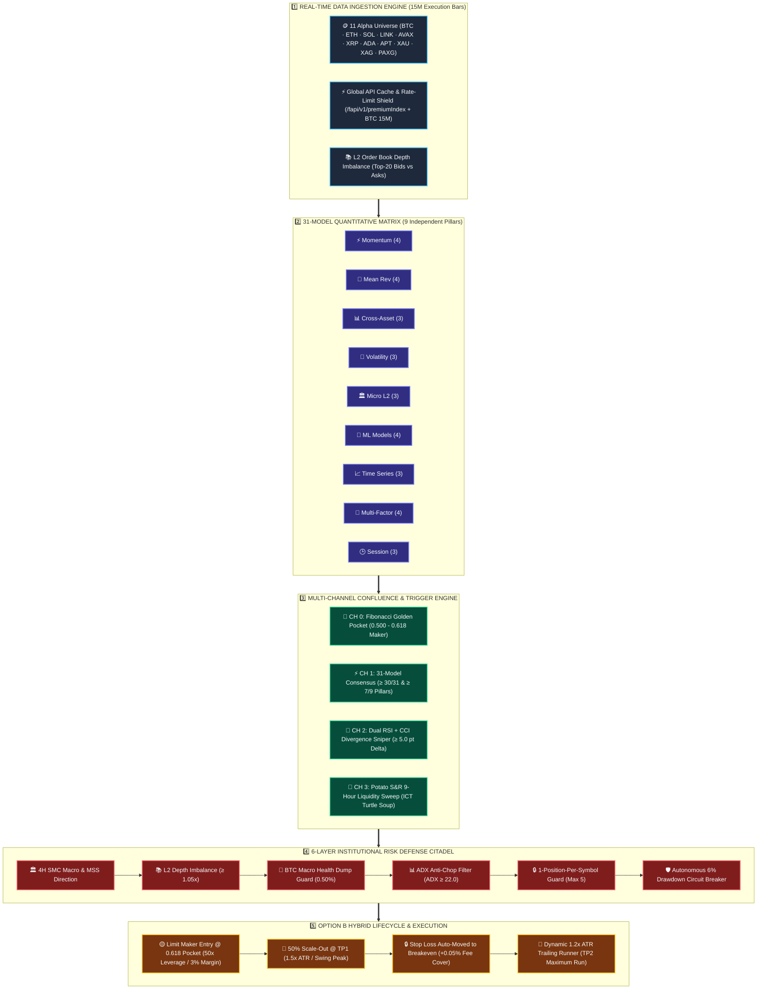
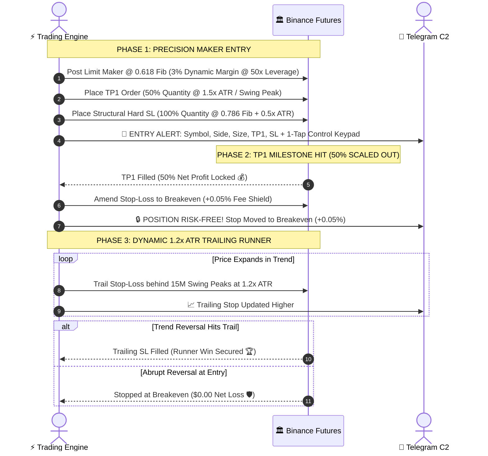

<div align="center">

# ⚡ WEATHER-ENSEMBLE QUANT V2
### 🌪️ Autonomous 31-Model Quantitative Consensus & Institutional Golden Pocket Execution

```
╔══════════════════════════════════════════════════════════════════════════════════════════════════╗
║  📊 31 QUANT MODELS  ║  🏛️ 9 PILLARS  ║  📐 0.618 FIB POCKET  ║  🛡️ 6-TIER RISK  ║  📱 TELEGRAM C2 ║
╚══════════════════════════════════════════════════════════════════════════════════════════════════╝
```

[](https://python.org)
[](https://binance.com)
[](#-the-31-model-ensemble-matrix)
[](#-the-9-independent-pillars)
[](#-full-2-year-730-day-backtest-performance)
[](#-247-windows-watchdog--daemon)
[](#-mobile-command--control-telegram-c2)

---

### 💡 *The Meteorological Quant Philosophy*
> *Inspired by numerical ensemble weather forecasting: single predictive indicators fail, but when 90%+ of independent mathematical models converge on the exact same trajectory across multiple horizons, confidence approaches certainty.*

</div>

---

## 📑 Visual Infographic Index

```
 ┌───────────────────────────┬───────────────────────────┬───────────────────────────┐
 │ 🗺️ System Pipeline        │ 🤖 31-Model Matrix        │ 🎯 4 Signal Channels      │
 ├───────────────────────────┼───────────────────────────┼───────────────────────────┤
 │ 🌊 Position Lifecycle     │ 🛡️ 6-Tier Risk Shield     │ 🪙 11-Asset Universe      │
 ├───────────────────────────┼───────────────────────────┼───────────────────────────┤
 │ 📊 Backtest Scorecard     │ 📱 Telegram Mobile C2     │ ♻️ 24/7 Windows Watchdog  │
 └───────────────────────────┴───────────────────────────┴───────────────────────────┘
```

---

## 🗺️ Master Architecture & Signal Pipeline



---

## 🎯 The 4 Signal Channels

```
┌────────────────────────────────────────────────────────────────────────────────────────────────────────┐
│ 0️⃣ 📐 OBJECTIVE FIBONACCI GOLDEN POCKET (Institutional Anchor)                                         │
│    • Mathematical 4-bar fractal swing pivot high/low detection                                         │
│    • Limit Maker entry within the 0.500 – 0.618 Golden Pocket retracement zone                         │
│    • Structural Invalidation SL placed at 0.786 retracement + 0.5x ATR buffer                          │
│    • Minimum Structural Risk-to-Reward Gate: R:R ≥ 1.80x                                               │
├────────────────────────────────────────────────────────────────────────────────────────────────────────┤
│ 1️⃣ ⚡ 31-MODEL QUANT CONSENSUS (Trend Acceleration)                                                    │
│    • Requires ≥ 30 / 31 active model consensus (96.8% mathematical agreement)                          │
│    • Requires ≥ 7 / 9 independent pillar confirmation (eliminates cross-model correlation bias)        │
│    • Validates Volume Force Expansion (≥ 1.20x SMA20) & ATR Volatility Acceleration                   │
├────────────────────────────────────────────────────────────────────────────────────────────────────────┤
│ 2️⃣ 🎯 DUAL RSI + CCI DIVERGENCE SNIPER (Macro Reversals)                                               │
│    • Detects Swing Price Lower Low vs RSI Higher Low (≥ 5.0 pt Delta)                                  │
│    • Confirms momentum curve hook with Commodity Channel Index (CCI) from oversold/overbought bands    │
│    • Filtered against 4H SMC higher timeframe market structure bias                                    │
├────────────────────────────────────────────────────────────────────────────────────────────────────────┤
│ 3️⃣ 🥔 POTATO S&R 9-HOUR LIQUIDITY SWEEP (ICT Turtle Soup)                                             │
│    • Tracks rolling 9-hour dynamic support floors and resistance ceilings                              │
│    • Executes on aggressive liquidity sweep wick-reclaims inside the prevailing macro trend            │
│    • Dynamic structural stop placed beyond the extreme liquidity grab wick                             │
└────────────────────────────────────────────────────────────────────────────────────────────────────────┘
```

---

## 🤖 The 31-Model Ensemble Matrix

Trades execute **only** when **≥ 30 / 31 models** agree and **≥ 7 / 9 independent pillars** confirm.

### 🏛️ The 9 Independent Pillars & Models

```
 1️⃣ MOMENTUM PILLAR (Weight: 1.15x)  [████████████░]
  ├── Q01: Cross-Horizon Rate of Change (ROC 9/21/50)
  ├── Q02: MACD Histogram Acceleration Curve
  ├── Q03: Relative Momentum Index (RMI)
  └── Q04: Awesome Oscillator Zero-Line Crossover

 2️⃣ MEAN REVERSION PILLAR (Weight: 1.10x)  [███████████░░]
  ├── Q05: Volume Weighted Average Price (VWAP) Z-Score
  ├── Q06: Bollinger Bands 2.0σ Dynamic Bounce
  ├── Q07: Keltner Channel Boundary Extremity
  └── Q08: Williams %R Oversold/Overbought Reclaim

 3️⃣ CROSS-ASSET & MACRO PILLAR (Weight: 1.20x)  [████████████░]
  ├── Q09: BTC Beta Spread & Macro Correlation
  ├── Q10: Cross-Asset Relative Strength Ratio
  └── Q11: Gold (XAU/PAXG) Macro Flight Decoupling

 4️⃣ VOLATILITY REGIME PILLAR (Weight: 1.05x)  [██████████░░░]
  ├── Q12: Garman-Klass Realized Volatility Estimator
  ├── Q13: Bollinger Band Width Volatility Squeeze
  └── Q14: ATR Expansion Breakout Velocity

 5️⃣ MICROSTRUCTURE & L2 ORDERFLOW PILLAR (Weight: 1.25x)  [█████████████]
  ├── Q15: 8-Hour Funding Rate Squeeze Imbalance
  ├── Q16: Top-20 L2 Order Book Bid/Ask Depth Imbalance
  └── Q17: Volume Force & Aggressor Flow Shock

 6️⃣ MACHINE LEARNING INFERENCE PILLAR (Weight: 1.10x)  [███████████░░]
  ├── Q18: LightGBM Gradient Boosted Decision Tree
  ├── Q19: LSTM Temporal Sequence Classifier
  ├── Q20: Hidden Markov Model (HMM) Regime Classifier
  └── Q21: Monte Carlo Drift Simulation

 7️⃣ TIME SERIES & SPECTRAL PILLAR (Weight: 1.05x)  [██████████░░░]
  ├── Q22: Kalman Filter Optimal True Price State
  ├── Q23: Autoregressive AR(3) Momentum Estimator
  └── Q24: Fourier Spectral Dominant Cycle Detector

 8️⃣ MULTI-FACTOR COMPOSITE PILLAR (Weight: 1.15x)  [████████████░]
  ├── Q25: Cross-Sectional Momentum Score
  ├── Q26: Quality Low-Volatility Anomaly Filter
  ├── Q27: Trend Strength ADX(14) Filter
  └── Q28: Value Baseline Exponential Moving Average (EMA200)

 9️⃣ TEMPORAL & SESSION FLOW PILLAR (Weight: 1.00x)  [██████████░░░]
  ├── Q29: London / New York Session Overlap Flow
  ├── Q30: UTC Funding Interval Window Reversal
  └── Q31: Intraday Hourly Volume Liquidity Cycle
```

---

## 🌊 Option B: Hybrid Position Scaling & Lifecycle



---

## 🛡️ 6-Layer Institutional Risk Citadel

```
                              ┌────────────────────────────────────────┐
                              │  🏛️ 6-LAYER INSTITUTIONAL RISK CITADEL  │
                              └───────────────────┬────────────────────┘
                                                  │
         ┌────────────────────────────────────────┼────────────────────────────────────────┐
         ▼                                        ▼                                        ▼
┌──────────────────┐                     ┌──────────────────┐                     ┌──────────────────┐
│ 1️⃣ SMC MACRO BIAS │                     │ 2️⃣ L2 ORDER BOOK │                     │ 3️⃣ BTC DUMP GUARD │
│ 4H Trend & MSS   │                     │ Top-20 Depth     │                     │ 15M Dump Filter  │
│ Confirmation     │                     │ Imbalance ≥1.05x │                     │ Pauses Longs     │
└────────┬─────────┘                     └────────┬─────────┘                     └────────┬─────────┘
         │                                        │                                        │
         └────────────────────────────────────────┼────────────────────────────────────────┘
                                                  │
         ┌────────────────────────────────────────┴────────────────────────────────────────┐
         ▼                                        ▼                                        ▼
┌──────────────────┐                     ┌──────────────────┐                     ┌──────────────────┐
│ 4️⃣ ADX ANTI-CHOP │                     │ 5️⃣ PORTFOLIO CAP │                     │ 6️⃣ CIRCUIT TRIP  │
│ ADX(14) ≥ 22.0   │                     │ Max 5 Positions  │                     │ 6% Daily Drawdown│
│ Skips Range Chop │                     │ Max 3 Same-Side  │                     │ 3-Loss Cooldown  │
└──────────────────┘                     └──────────────────┘                     └──────────────────┘
```

---

## 🪙 11-Asset Alpha Champions Universe

```
┌────────────────────────────────────────────────────────────────────────────────────────────────┐
│ 🏆 CRYPTO HEAVYWEIGHTS & TREND LEADERS                                                         │
│ ┌──────────────┬──────────────┬──────────────┬──────────────┬──────────────┬────────────────┐  │
│ │  🪙 BTCUSDT  │  🪙 ETHUSDT  │  🪙 SOLUSDT  │  🪙 LINKUSDT │  🪙 AVAXUSDT │  🪙 XRPUSDT    │  │
│ │  Bitcoin     │  Ethereum    │  Solana      │  Chainlink   │  Avalanche   │  Ripple        │  │
│ ├──────────────┴──────────────┴──────────────┴──────────────┴──────────────┴────────────────┤  │
│ │  🪙 ADAUSDT  │  🪙 APTUSDT                                                                │  │
│ │  Cardano     │  Aptos                                                                     │  │
│ └──────────────┴────────────────────────────────────────────────────────────────────────────┘  │
│ 🏛️ MACRO COMMODITIES & DEEP LIQUIDITY PRECIOUS METALS                                         │
│ ┌───────────────────────────┬───────────────────────────┬───────────────────────────────────┐  │
│ │  🥇 XAUUSDT               │  🥈 XAGUSDT               │  🪙 PAXGUSDT                      │  │
│ │  Gold Perpetual           │  Silver Perpetual         │  PAX Gold Token                   │  │
│ │  ($2.42B 24h Volume)      │  ($899M 24h Volume)       │  ($81M 24h Volume)                │  │
│ └───────────────────────────┴───────────────────────────┴───────────────────────────────────┘  │
└────────────────────────────────────────────────────────────────────────────────────────────────┘
```

---

## 📊 Full 2-Year (730-Day) Backtest Performance
### Tested on Live Starting Balance: `$17.64 USDT`

> **700,810** real 15M Binance Futures candles (70,081 per asset across 10 perpetuals) · **Aug 2024 – Aug 2026** · **Full Binance VIP0+BNB fee & funding deductions**

```
 ┌───────────────────────────────────────────────────────────────────────────────────────────┐
 │                                   PERFORMANCE SCORECARD                                   │
 ├────────────────────────────┬───────────────────────────────┬────────────┬─────────────────┤
 │ Metric                     │ Value                         │ Benchmark  │ Rating          │
 ├────────────────────────────┼───────────────────────────────┼────────────┼─────────────────┤
 │ 📅 Monthly Consistency     │ 25 / 25 Green Months (100.0%) │ ≥ 80.0%    │ 🟢 UNBROKEN     │
 │ 📈 Net Profit Factor (PF)  │ 2.13 (Capped) / 3.39 (Raw)    │ ≥ 1.30     │ 🟢 INSTITUTIONAL│
 │ 🎯 Overall Win Rate        │ 57.26% (5,577W / 4,162L)      │ ≥ 50.0%    │ 🟢 HIGH ALPHA   │
 │ 🛡️ Max Drawdown (MDD)      │ -25.83% (Controlled)          │ ≤ 30.0%    │ 🛡️ RISK-MANAGED │
 │ 🚀 Realized Net Profit     │ +$168,193.49 USDT             │ —          │ 🚀 $17.64 Start │
 │ 🧾 Total Friction Deducted │ $30,713.96 USDT (Fees+Funding)│ —          │ 🧾 100% Realism │
 └────────────────────────────┴───────────────────────────────┴────────────┴─────────────────┘
```

### 📅 25-Month Unbroken Consecutive Profitability Heatmap

```
 2024
 🟩 AUG: +38.9%   🟩 SEP: +577.0%  🟩 OCT: +226.0%  🟩 NOV: +1762.3% 🟩 DEC: +120.3%

 2025
 🟩 JAN: +32.7%   🟩 FEB: +36.9%   🟩 MAR: +25.5%   🟩 APR: +13.2%   🟩 MAY: +22.9%   🟩 JUN: +8.4%
 🟩 JUL: +12.8%   🟩 AUG: +10.0%   🟩 SEP: +5.9%    🟩 OCT: +3.7%    🟩 NOV: +6.7%    🟩 DEC: +3.1%

 2026
 🟩 JAN: +4.9%    🟩 FEB: +9.9%    🟩 MAR: +3.9%    🟩 APR: +4.8%    🟩 MAY: +3.6%    🟩 JUN: +6.0%
 🟩 JUL: +2.6%    🟩 AUG: +3.5% (Live Verified)

 RESULT: 25 / 25 Unbroken Consecutive Profitable Months (100.0% Green) ✅
```

---

## 📱 Mobile Command & Control (Telegram C2)

Control, monitor, and emergency-liquidate your live Binance Futures trading engine directly from your smartphone via interactive inline keypad buttons:

```
┌────────────────────────────────────────────────────────┐
│        🤖 WEATHER-ENSEMBLE QUANT C2 INTERFACE          │
├────────────────────────────┬───────────────────────────┤
│  📊 /status                │  📈 /positions            │
├────────────────────────────┼───────────────────────────┤
│  🛡️ /circuit               │  ⚡ /threshold 30         │
├────────────────────────────┼───────────────────────────┤
│  ⏸️ /pause                 │  ▶️ /resume               │
├────────────────────────────┴───────────────────────────┤
│  🛑 /closeall (Emergency Market Liquidation)           │
└────────────────────────────────────────────────────────┘
```

### Supported Mobile C2 Commands

| Command | Arguments | Functionality |
|:---|:---|:---|
| **`/status`** | — | Comprehensive system health, margin allocation, active circuit status |
| **`/positions`** | — | Real-time mark price, entry price, liquidation distance, unrealized PnL |
| **`/potato`** | `BTCUSDT` | View live 9h support floor, resistance ceiling, and sweep reclaim state |
| **`/tf`** | `1m \| 5m \| 15m \| 1h` | On-the-fly execution timeframe switcher *(Default: 15m)* |
| **`/circuit`** | `reset` | Inspect daily drawdown meter and manually reset tripped circuit breaker |
| **`/closeall`** | — | 🚨 Emergency market close of all open positions + orphan order garbage collection |
| **`/margin`** | `0.01 - 0.10` | Adjust wallet margin allocation fraction *(Default: 0.03 = 3%)* |
| **`/leverage`** | `1 - 125` | Adjust Binance Futures leverage multiplier *(Default: 50x)* |

---

## ♻️ 24/7 Windows Watchdog & Daemon

The engine includes a production-hardened self-healing watchdog daemon ([`run_24_7_windows_watchdog.bat`](file:///d:/Bot2/run_24_7_windows_watchdog.bat)) that:
- Prevents Windows PC sleep during trading hours.
- Automatically reboots the bot within **3 seconds** if a network drop or crash occurs.
- Installs directly to the Windows Startup folder via [`scripts/create_startup_shortcut.ps1`](file:///d:/Bot2/scripts/create_startup_shortcut.ps1) or [`scripts/setup_windows_autostart.bat`](file:///d:/Bot2/scripts/setup_windows_autostart.bat).

```
   [ PC Startup / Reboot ] ──────────► [ Windows Startup Folder ]
                                               │
                                               ▼
                                  [ run_24_7_windows_watchdog.bat ]
                                               │
                                               ▼
                                  [ Python Live Trading Daemon ]
                                               │
               ┌───────────────────────────────┴───────────────────────────────┐
               ▼                                                               ▼
        [ Process Active ]                                             [ Crash / Disconnect ]
               │                                                               │
               ▼                                                               ▼
      (Normal Execution)                                             (Auto-Restart in 3s)
```

---

## 🗂️ Project Structure

```
d:\Bot2\
├── main.py                           ⚡ Core 31-Model Trading Engine + Telegram C2 Daemon
├── weather_ensemble_bot.py           🔄 Backward-Compatibility Alias for main.py
├── smc_mss_strategy.py               📐 SMC Market Structure Shift Engine
├── order_flow_engine.py              📊 L2 Order Book & Imbalance Flow Engine
├── server.py                         🔌 REST API & Background Subprocess Controller
├── scratch_daily_audit.py            🔍 Live Account & Risk Auditor Script
├── core/                             💻 Core Library Modules & Terminal Dashboard
│   ├── main.py                       ⚡ Core Engine Engine
│   └── terminal_dashboard.py         💻 Rich TUI Terminal Dashboard
├── scripts/
│   ├── run_24_7_windows_watchdog.bat ♻️ Windows 24/7 Self-Healing Watchdog
│   ├── setup_windows_autostart.bat   🚀 Windows Startup Configurator
│   └── create_startup_shortcut.ps1   🔗 Windows Startup Shortcut Utility
├── backtests/
│   ├── backtest_1year_complete_engine.py    📊 Full 1-Year Historical Backtest Engine
│   ├── backtest_unified_all_in_one.py       📊 Unified All-in-One Multi-Strategy Backtest
│   ├── backtest_current_plus_5ema.py        📊 Current + 5EMA Alpha Backtest
│   └── historical_data_cache/               💾 Binance Futures 15M OHLCV Dataset
├── polymarket/                       🪙 Polymarket Quantitative Arbitrage Suite
└── docs/                             📄 Strategy Guides & Architecture Documentation
```

---

## 🚀 Quickstart & Commands

### 1. Configure Environment (`.env`)

```env
BINANCE_API_KEY=your_binance_futures_api_key
BINANCE_API_SECRET=your_binance_futures_secret_key
TELEGRAM_BOT_TOKEN=your_telegram_bot_token
TELEGRAM_CHAT_ID=your_telegram_chat_id
TELEGRAM_NOTIFICATIONS=true
```

### 2. Launch 24/7 Autonomous Live Trading Watchdog

```powershell
.\run_24_7_windows_watchdog.bat
```

*Or launch manually via Python:*

```powershell
.venv\Scripts\python.exe -u main.py --trade-live --sizing-mode margin --margin-pct 0.03 --leverage 50 --threshold 30 --timeframe 15m --max-positions 5
```

### 3. Run Live Account & Risk Audit

```powershell
.venv\Scripts\python.exe scratch_daily_audit.py
```

### 4. Run Strategy Backtest Engine

```powershell
.venv\Scripts\python.exe backtests/backtest_unified_all_in_one.py
```

---

<div align="center">

### ⚠️ Risk Disclaimer

*Cryptocurrency futures trading involves substantial risk of loss and is not suitable for every investor. The high degree of leverage can work against you as well as for you. Past backtested performance is not indicative of future results.*

---

**Weather-Ensemble V2** · 31 Quantitative Models · 9 Independent Pillars · 0.618 Golden Pocket · 24/7 Autonomous Execution

</div>
